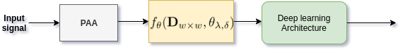

# Adaptive Weighted Recurrence Graph for Appliance Recognition in Non-Intrusive Load Monitoring
This repository is the official implementation of [Adaptive Weighted Recurrence Graph for Appliance Recognition in Non-Intrusive Load Monitoring](). 
This paper proposes hyper-parameter free weighted recurrence graphs block (AWRG) for appliance feature representation in NILM and apply Convolutional Neural Networks for classification. The proposed AWRG block is included in the learning pipe-line as part of the end-to-end feature learning with deep learning networks. We conduct an extensive evaluation of two datasets collected from residential and industrial environments. In contrast to other approaches that use sub-metered data, we test our method on aggregated power measurements, which is much more realistic. Furthermore, we contrast the multi-dimension three-phase system in industrial settings and the single-phase system in residential buildings, which is not common in the literature. 

This package contains a Python implementation of Adaptive Recurrence Graph for Appliance classification in NILM. 

## Requirements
- python
- numpy
- pandas
- matplotlib
- tqdm
- torch
- sklearn
- seaborn
- nptdms 

## Usage

1. Preprocess the data for a specific dataset. Note: the data directory provided includes preprocessed data for the two datasets LILAC and PLAID.
2. To replicate experiment results you can run the `run_experiments.py` code in the src directory. 
3. The script used to analyse results and produce visualisation presented in this paper can be found in notebook directory
    - Results Analysis notebook provide scripts for results and error analysis.
    - Visualisation paper notebook provide scripts for reproducing most of the figure used in this paper.

